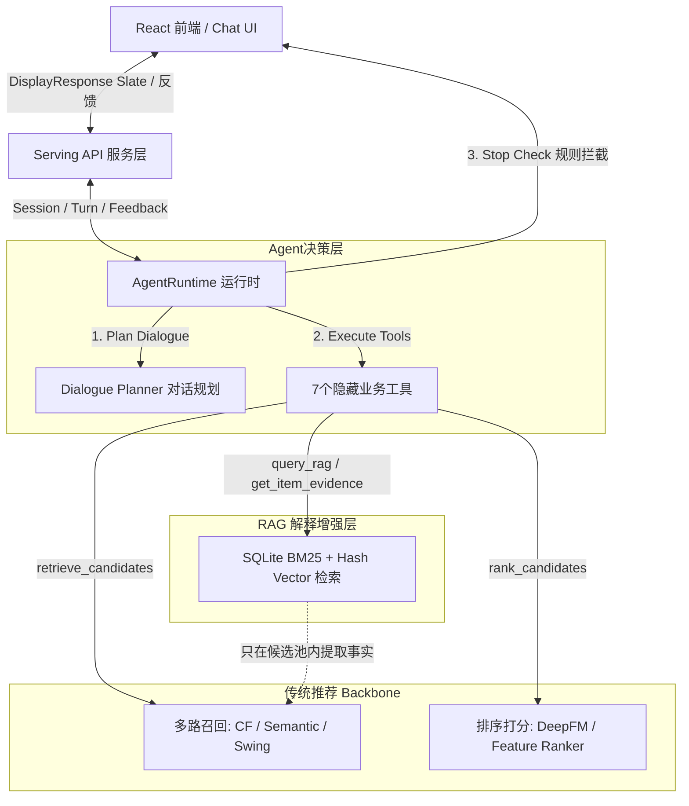

# RS Agent 推荐系统面试防拷打复盘指南

本项目采用 **Agent 编排决策层 + 传统推荐 Backbone 底座 + Candidate-Scoped RAG** 的混合推荐系统架构。为了应对面试官可能提出的深度技术拷打，本指南整理了核心设计要点、技术折中与高频 Mock Q&A。

---

## 1. 核心架构与设计哲学

在面试中，首要讲清系统的核心定位和设计边界：**Agent 负责决策与多轮交互，推荐 Backbone 负责召回与排序，RAG 负责事实 Grounding，中间通过训练对齐，外围利用仿真测试。**

---

## 2. 面试高频“拷打”问题与标准回答

### 拷打点 1：架构选型
> **面试官：** 既然你用了大模型，为什么不直接让 LLM 端到端输出推荐结果，或者干脆用纯传统推荐系统？为什么要搞这种混合架构？

* **答题痛点**：如果只吹 LLM，面试官会质疑延迟、成本和幻觉；如果只吹传统推荐，面试官会觉得没有 Agent 创新性。
* **标准回答**：
  1. **大模型的物理限制**：大模型的 Context Window 无法容纳数十万的商品 Catalog，端到端推荐不仅耗时高（Latency 动辄几秒）、推理成本贵，而且具有严重的**幻觉问题**（可能会凭空捏造商品 ID 或不存在的卖点）。
  2. **传统推荐的局限**：传统推荐底座（如 Collaborative Filtering、DeepFM）虽然计算效率高、可控性强，但它们**无法直接理解用户的自然语言意图**，更无法在多轮对话中动态抽取、累积和更新用户的软硬约束（例如：“要便宜点的、不要电子产品、偏好降噪功能”）。
  3. **我们的解耦方案**：我们保留了**传统推荐 Backbone 做底座**，负责进行大规模粗筛和打分（解决效率与基本品质）；**Agent 决策层站在底座生成的 Top-K 候选之上做编排**，负责理解用户意图、转化约束并做二次重排和解释（解决个性化、灵活性与多轮交互）。

---

### 拷打点 2：工具层解耦与安全边界
> **面试官：** 你的 Agent 是如何调用推荐系统的？如果底层新增了一个召回算法（比如双塔向量召回），你的 Agent 工具契约需要修改吗？

* **答题痛点**：如果大模型能直接看到 `itemcf_strong_recall`、`dssm_vector_search` 等工程细节，前后台耦合太重，不具备工业级扩展性。
* **标准回答**：
  1. **统一业务工具契约**：我们设计了 **7 个隐藏业务工具**（`get_user_context`、`query_rag`、`retrieve_candidates`、`rank_candidates`、`get_item_evidence`、`record_user_feedback`、`build_recommendation_slate`）。
  2. **前后台彻底解耦**：Agent 只能看到这些高层业务工具的入参 and 出参。底座召回几路、用什么推荐模型（如 ItemCF、DSSM 还是 Swing），全部封装在 `retrieve_candidates` 和 `rank_candidates` 内部；`query_rag` 只做推荐前 query planning / 商品知识提示，不替代召回或排序。前台 Agent 对底层工程细节**完全无感知**。
  3. **安全防泄漏（Public Payload Guard）**：为了防止内部诊断信息污染用户界面，我们规定 `build_recommendation_slate` 是唯一允许输出 `public payload` 的工具。所有内部打分 trace、`feature_rows`、`score_trace`、召回源标签等诊断字段均被 `validate_public_display_payload()` 拦截，防止前台信息泄露。

---

### 拷打点 3：RAG 幻觉控制与 provenance gate
> **面试官：** 大模型在生成“推荐理由”时容易编造卖点。你的 RAG 是如何为 Agent 提供商品事实支撑的？它是怎么防范信息泄漏的？

* **答题痛点**：传统的 RAG 往往直接基于全量库检索，容易把未进入候选池的无关物品引入进来，污染了推荐过滤链路。
* **标准回答**：
  1. **Candidate-Scoped RAG（候选内取证）**：我们的 RAG 绝不作为新的召回源。它的数据范围被严格限制在**已被底座召回并排序后的候选物品集合内**。
  2. **SQLite 混合检索（Hybrid Retrieval）**：我们在 SQLite 中构建了商品属性的分段 Chunk（Title、Category 整体 chunk，Description 句分割，Features 按 Bullet 分割），并基于 SQLite FTS5 实现了 **BM25 关键词匹配 + 局部 hashed 文本向量余弦相似度** 的混合检索，为 Agent 提供精准的商品事实证据（Evidence）。
  3. **溯源门禁（Provenance Gate）**：在 RAG 数据加载 and 检索过程中，设置了 provenance gate，严格拦截包含 `label`、`holdout`、`oracle`、`ground_truth` 或带有未来信息（future-like）的评估字段，确保测试集的纯净度，防止模型在评估期产生指标作弊。

---

### 拷打点 4：系统安全性与约束硬拦截（Runtime Stop-Check）
> **面试官：** 大模型（LLM）的指令遵循能力不是 100% 稳定的。如果用户说“不要推荐电子产品”，但 LLM 的工具链或底座依然推荐了电子产品，你怎么保证系统的安全红线？

* **答题痛点**：不能回答“我们微调了模型”或者“提示词写得很严格”，因为这在工业界无法保证 100% 安全。
* **标准回答**：
  1. **双重保障（提示词规划 + 运行期硬拦截）**：我们没有把安全底线寄托在模型的概率生成上。
  2. **运行时规则拦截（Runtime Stop-Check）**：在 `AgentRuntime.run_turn` 的最后一环，我们实现了一个基于规则的硬过滤器（`_stop_check`）。它直接从当前会话的 `FeedbackConstraints` 中提取硬性过滤规则（如 `disliked_item_ids`、`disliked_categories`）。
  3. **自愈与降级**：如果在输出前发现候选列表里存在冲突商品，规则引擎会**物理剔除**违规商品（Repaired），重新计算 Turn Reward，并自动触发 fallback 机制（生成警示 risk_flags，修改回复为安全文案）。这套机制确保了无论 LLM 怎么幻觉，输出给用户的 slate 始终符合硬性过滤规范。

---

### 拷打点 5：仿真评估与数据闭环
> **面试官：** 推荐 Agent 是多轮交互系统，用传统的离线静态测试集（如 Recall@K）很难评测其对话好坏。你们是怎么评估整个系统效果的？

* **答题痛点**：多轮推荐 Agent 没有标准 Ground Truth 标签，静态评估无法体现“反馈后第二轮推荐是否变好”。
* **标准回答**：
  1. **多角色仿真沙盒（Multi-Persona Simulator）**：我们实现了一套基于 Persona 的模拟用户仿真层。每个模拟客户有特定的购物目标（Goal）、预算范围和反馈风格。
  2. **批量多轮对打评估**：通过让 Simulator 与 RS Agent 自动交互多个 Turn，记录整个交互轨迹（Session Replay）。
  3. **多维指标量化**：自动收集并计算多轮交互指标，包括**满意度转化率**、**约束满足率**、**多轮意图偏离度**，输出 `simulation_batch.json` 评估报告。
  4. **样本回流与对齐支撑**：仿真沙盒和真实 React Demo 沉淀的轨迹数据，可以被整理为 session 轨迹，用来作为后续 SFT 监督微调和 GRPO（Group Relative Policy Optimization）强化学习训练的样本，形成“交互-仿真-评估-对齐”的数据闭环。

---

## 3. 面试表达亮点（Golden Sentence）

在自我介绍或回答架构时，可用以下一句话提炼亮点，先发制人：

> 💡 **“在这个项目中，我没有让大模型做端到端的黑盒推荐，而是设计了‘大模型做策略调度、传统 Backbone 做候选与排序过滤、RAG 做候选事实 grounding’的分层解耦架构，并且在运行时通过物理 Stop-Check 规则为 LLM 守住用户的硬约束底线。”**

---

## 4. 关键指标与实验折中表现（以事实说话）

面试官最怕空谈理论，准备好以下真实指标可以极大增强说服力：

* **Item-level Feature Rerank 实验**：
  * *结论*：在重排模块中引入项目级别特征后，Top-K 命中率基本持平，但 LOPO（Leave-One-Out Evaluation）Target 商品的平均排名从 **25.13** 提升/提前到了 **23.46**。
  * *反思/折中*：这说明 item-level 特征排序更适合作为可解释排序特征的入口，而不是直接提升 hit-rate 的万灵药。
* **向量召回双塔旁路（DSSM/YouTubeDNN）实验**：
  * *状态*：当前作为默认关闭的实验旁路。
  * *门禁阻拦原因*：在 smoke 评估（10用户训练/30用户评估）中，双塔 valid/test 的 $HitRate@K$ 表现为 0.0，且 Latency 超过了 $0.05s$ 的 strict gate 预算。
  * *面试亮点*：没有盲目为了堆技术栈而强行上线双塔召回，而是制订了严格的晋升门禁（Sanity Gate）。在模型效果和耗时未达标前，保持 `default_off_side_lane`，体现了严谨 of 工程思维。
